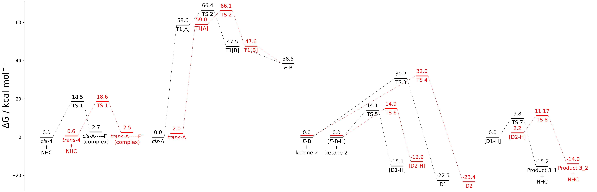
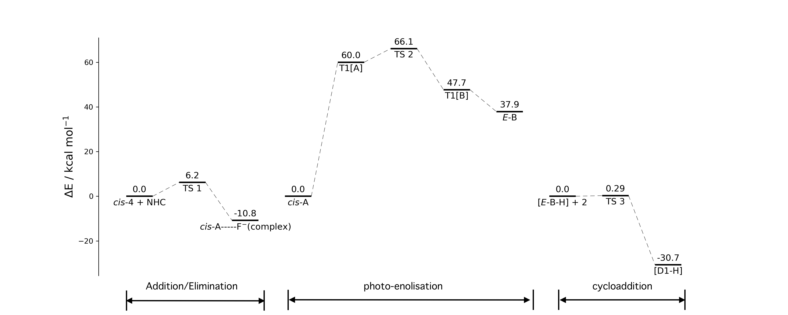

# DrawEnergyProfile
An easy to use and a robust python package for plotting energy profile diagrams of reactions.

## Overview
DrawEnergyProfile gives user an ability to plot stationary levels with the user-defined parameters, so that one is not bounded to predefined inputs.
It also gives user to save diagram in any format and user-defined dpi and size. It provides user the tweaking parameteres to vary the parameters e.g., length of stationary level, distance between levels, position of first level, vertical spacing between level and label, color, fontsize etc to make diagrams beautiful as per different figure sizes.

## Requirement 
matplotlib

## Sample Diagram

The second and third sample diagrams are generated by concatenating 3 figures (for three different reactions) to show how beautiful diagrams we can make with this package.
## Usage instructions
Please follow the example (sample.py) in example folder. Output shown as above.

The user is advised to vary the parameters (length of stationary level, distance between levels, position of first level, vertical spacing between level) with respect to the different figure size (length, width) inputs.

